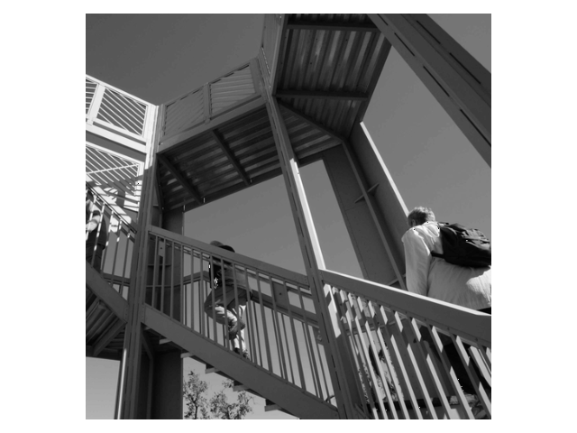
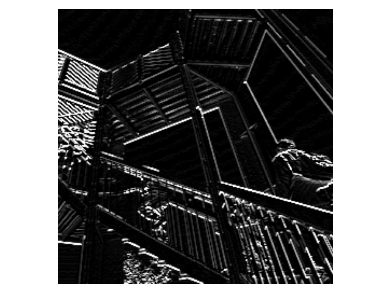

<h1>tensorflow实践案例</h1>
<h2>这是什么</h2>
这是coursera平台<a href="https://www.coursera.org/professional-certificates/tensorflow-in-practice" target="_blank">tensorflow课程</a>代码，随堂练习+课后作业
<ol>
    <li><a href="https://www.coursera.org/learn/introduction-tensorflow" target="_blank">tensorflow入门</a></li>
</ol>
<h2>模型</h2>
<ul>
    <li>分类
        <ul>
            <li><a href="./classifier/FashionClassifier.py" target="_blank">时尚商品分类器</a></li>
            <li><a href="./classifier/HandwritingClassifier.py" target="_blank">手写数字分类器</a></li>
            <li><a href="./classifier/HorseHumanClassifier.py" target="_blank">人马分类器</a></li>
            <li><a href="./classifier/HappySadClassifier.py" target="_blank">高兴悲伤分类器</a></li>
            <li><a href="./classifier/CatDogClassifier.py" target="_blank">猫狗分类器</a></li>
        </ul>
    </li>
    <li>回归
        <ul>
            <li><a href="./regressor/LinearRegressor.py" target="_blank">一元线性回归</a></li>
        </ul>
    </li>
    <li>工具
        <ul>
            <li><a href="./utils/layers.py" target="_blank">层</a>
                <ul>
                    <li>卷积</li>
                    <li>最大池化</li>
                </ul>
            </li>
            <li><a href="./utils/images.py" target="_blank">图像</a>
                <ul>
                    <li>显示图像</li>
                </ul>
            </li>
        </ul>
    </li>
</ul>
<h2>tensorflow的包结构</h2>
<ul>
    <li>keras
        <ul>
            <li>layers
                <ul>
                    <li>Dense</li>
                    <li>Flatten</li>
                    <li>Conv2D</li>
                    <li>MaxPooling2D</li>
                </ul>
            </li>
            <li>models
                <ul>
                    <li>Sequential</li>
                    <li>Model</li>
                </ul>
            </li>
            <li>datasets
                <ul>
                    <li>fashion_mnist</li>
                    <li>mnist</li>
                </ul>
            </li>
            <li>optimizers
                <ul>
                    <li>Adam</li>
                    <li>RMSprop</li>
                </ul>
            </li>
            <li>callbacks
                <ul>
                    <li>Callback</li>
                    <li>TensorBoard</li>
                    <li>History</li>
                </ul>
            </li>
            <li>backend
                <ul>
                    <li>clear_session</li>
                </ul>
            </li>
            <li>preprocessing
                <ul>
                    <li>image
                        <ul>
                            <li>ImageDataGenerator</li>
                            <li>DirectoryIterator</li>
                            <li>load_img</li>
                            <li>img_to_array</li>
                        </ul>
                    </li>
                </ul>
            </li>
        </ul>
    </li>
    <li>nn
        <ul>
            <li>relu</li>
            <li>softmax</li>
        </ul>
    </li>
    <li>optimizers
        <ul>
            <li>Adam</li>
            <li>RMSprop</li>
        </ul>
    </li>
    <li>compat
        <ul>
            <li>v1
                <ul>
                    <li>ConfigProto</li>
                    <li>Session</li>
                </ul>
            </li>
            <li>v2
            </li>
        </ul>
    </li>
</ul>
<h2>图形展示</h2>
<h3>卷积神经网络内部做了什么</h3>
<h4>对于时尚商品分类，从左至右网络不断加深</h4>

<h4>对于猫狗识别，从上至下网络不断加深</h4>
 
 
 
 
 
 
 
 
 
<h3>卷积层和池化层做了些什么</h3>

原图

卷积后输出

池化后输出

<h3>人马分类</h3>

