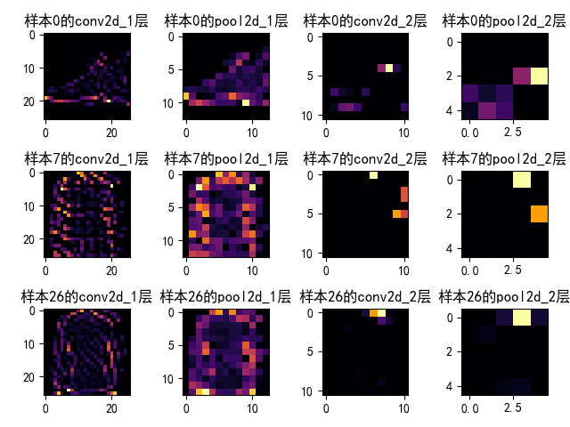
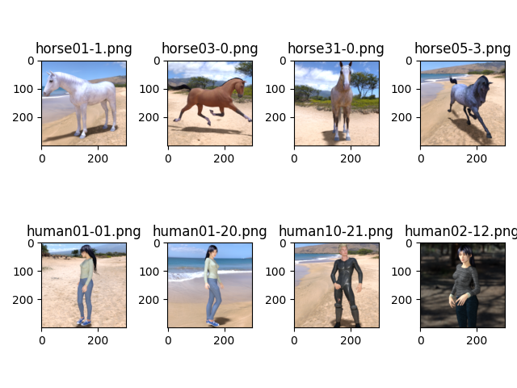

<h1>tensorflow入门</h1>
<h2>这是什么</h2>
这是coursera平台tensorflow课程(<a href="https://www.coursera.org/learn/introduction-tensorflow" target="_blank">地址</a>)入门代码，随堂练习+课后作业
<h2>目录结构</h2>
<ol>
    <li>一种新的编程范式
        <ul>
            <li><a href="./1st - A New Programing Paradigm/LinearRegression.py">线性回归</a></li>
            <li><a href="./1st - A New Programing Paradigm/HousePrices.py" target="_blank">房价回归模型</a></li>
        </ul>
    </li>
    <li>编写计算机视觉神经网络
        <ul>
            <li><a href="./2nd - Introduction to Computer Vision/FashionMNIST.py" target="_blank">衣裤鞋包识别</a></li>
            <li><a href="./2nd - Introduction to Computer Vision/HandwritingRecognition.py" target="_blank">手写字符识别</a></li>
        </ul>
    </li>
    <li>使用卷积神经网络增强
        <ul>
            <li>
            <a href="./3rd - Enhancing Vision with Convolutional Neural Networks/FashionMNIST.py" target="_blank">衣裤鞋包识别</a> 
            </li>
        </ul>
    </li>
</ol>
<h2>tensorflow的包结构</h2>
<ul>
    <li>keras
        <ul>
            <li>layers
                <ul>
                    <li>Dense</li>
                    <li>Flatten</li>
                    <li>Conv2D</li>
                    <li>MaxPooling2D</li>
                </ul>
            </li>
            <li>models
                <ul>
                    <li>Sequential</li>
                    <li>Model</li>
                </ul>
            </li>
            <li>datasets
                <ul>
                    <li>fashion_mnist</li>
                    <li>mnist</li>
                </ul>
            </li>
            <li>optimizers
                <ul>
                    <li>Adam</li>
                    <li>RMSprop</li>
                </ul>
            </li>
            <li>callbacks
                <ul>
                    <li>Callback</li>
                    <li>TensorBoard</li>
                </ul>
            </li>
            <li>backend
                <ul>
                    <li>clear_session</li>
                </ul>
            </li>
            <li>preprocessing
                <ul>
                    <li>image
                        <ul>
                            <li>ImageDataGenerator</li>
                            <li>load_img</li>
                            <li>img_to_array</li>
                        </ul>
                    </li>
                </ul>
            </li>
        </ul>
    </li>
    <li>nn
        <ul>
            <li>relu</li>
            <li>softmax</li>
        </ul>
    </li>
    <li>optimizers
        <ul>
            <li>Adam</li>
            <li>RMSprop</li>
        </ul>
    </li>
    <li>compat
        <ul>
            <li>v1
                <ul>
                    <li>ConfigProto</li>
                    <li>Session</li>
                </ul>
            </li>
            <li>v2
            </li>
        </ul>
    </li>
</ul>
<h2>图形展示</h2>
<h3>卷积神经网络内部做了什么</h3>

<h3>卷积层和池化层</h3>

原图

卷积后输出

池化后输出

<h3>人马分类</h3>

