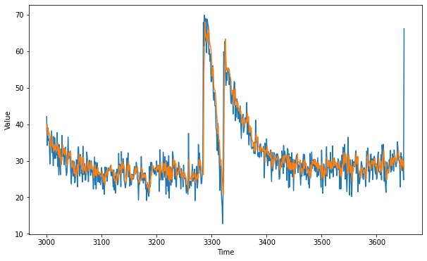

<h1>tensorflow实践案例</h1>
<h2>这是什么</h2>
这是coursera平台<a href="https://www.coursera.org/professional-certificates/tensorflow-in-practice" target="_blank">tensorflow课程</a>代码，随堂练习+课后作业
<ol>
    <li><a href="https://www.coursera.org/learn/introduction-tensorflow" target="_blank">tensorflow入门</a></li>
    <li><a href="https://www.coursera.org/learn/convolutional-neural-networks-tensorflow" target="_blank">tensorflow的卷积神经网络</a></li>
    <li><a href="https://www.coursera.org/learn/natural-language-processing-tensorflow" target="_blank">tensorflow的自然语言处理</a></li>
    <li><a href="https://www.coursera.org/learn/tensorflow-sequences-time-series-and-prediction" target="_blank">时间序列预测</a></li>
</ol>
<h2>包结构</h2>
<ul>
    <li><a href="./classifier" target="_blank">分类</a>
        <ul>
            <li><a href="./classifier/FashionClassifier.py" target="_blank">时尚商品分类器</a></li>
            <li><a href="./classifier/HandwritingClassifier.py" target="_blank">手写数字分类器</a></li>
            <li><a href="./classifier/HorseHumanClassifier.py" target="_blank">人马分类器</a></li>
            <li><a href="./classifier/HappySadClassifier.py" target="_blank">高兴悲伤分类器</a></li>
            <li><a href="./classifier/CatDogClassifier.py" target="_blank">猫狗分类器</a></li>
            <li><a href="./classifier/CatDogClassifierInceptionV3.py" target="_blank">基于InceptionV3迁移的猫狗分类器</a></li>
            <li><a href="./classifier/RockPaperScissorsClassifier.py" target="_blank">石头剪子布分类器</a></li>
            <li><a href="./classifier/ImdbClassifier.py" target="_blank">电影评论分类器</a></li>
            <li><a href="./classifier/ImdbSubwordsClassifier.py" target="_blank">电影评论词缀分类器</a></li>
            <li><a href="./classifier/SarcasmClassifier.py" target="_blank">讽刺分类器</a></li>
            <li><a href="./classifier/TextGenerator.py" target="_blank">文本生成器</a></li>
        </ul>
    </li>
    <li><a href="./classifier" target="_blank">回归</a>
        <ul>
            <li><a href="./regressor/LinearRegressor.py" target="_blank">一元线性回归</a></li>
            <li><a href="./regressor/TimeSeriesRegressor.py" target="_blank">时间序列回归</a></li>
        </ul>
    </li>
    <li><a href="./utils" target="_blank">工具</a>
        <ul>
            <li><a href="./utils/layers.py" target="_blank">层</a>
                <ul>
                    <li>卷积</li>
                    <li>最大池化</li>
                </ul>
            </li>
            <li><a href="./utils/images.py" target="_blank">图像</a>
                <ul>
                    <li>显示图像</li>
                </ul>
            </li>
            <li><a href="./utils/time_series" target="_blank">时间序列</a>
                <ul>
                    <li><a href="./utils/time_series/TimeSeries.py" target="_blank">时间序列基类</a></li>
                    <li><a href="./utils/time_series/TrendSeries.py" target="_blank">趋势序列类</a></li>
                    <li><a href="./utils/time_series/SeasonSeries.py" target="_blank">周期序列类</a></li>
                    <li><a href="./utils/time_series/NoiseSeries.py" target="_blank">噪声序列类</a></li>
                    <li><a href="./utils/time_series/AutoCorrelation.py" target="_blank">自相关序列类</a></li>
                    <li><a href="./utils/time_series/MixedSeries.py" target="_blank">混合序列类</a></li>
                    <li><a href="./utils/time_series/TimeSeriesUtils.py" target="_blank">时间序列工具类</a></li>
                </ul>
            </li>
        </ul>
    </li>
    <li><a href="./callbacks" target="_blank">回调</a>
        <ul>
            <li><a href="./callbacks/EarlyStopByAccuracy.py" target="_blank">Early stop</a></li>
        </ul>
    </li>
</ul>
<h2>tensorflow的包结构</h2>
<ul>
    <li>keras
        <ul>
            <li>Input</li>
            <li>layers
                <ul>
                    <li>Dense</li>
                    <li>Flatten</li>
                    <li>Conv1D</li>
                    <li>Conv2D</li>
                    <li>MaxPooling2D</li>
                    <li>GlobalAveragePooling1D</li>
                    <li>GlobalAveragePooling2D</li>
                    <li>Dropout</li>
                    <li>LSTM</li>
                    <li>Bidirectional</li>
                </ul>
            </li>
            <li>models
                <ul>
                    <li>load_model</li>
                    <li>Sequential</li>
                    <li>Model</li>
                </ul>
            </li>
            <li>losses
                <ul>
                    <li>BinaryCrossentropy</li>
                </ul>
            </li>
            <li>datasets
                <ul>
                    <li>fashion_mnist</li>
                    <li>mnist</li>
                </ul>
            </li>
            <li>optimizers
                <ul>
                    <li>Adam</li>
                    <li>RMSprop</li>
                </ul>
            </li>
            <li>callbacks
                <ul>
                    <li>Callback</li>
                    <li>TensorBoard</li>
                    <li>History</li>
                </ul>
            </li>
            <li>applications
                <ul>
                    <li>InceptionV3</li>
                    <li>MobileNetV2</li>
                </ul>
            </li>
            <li>backend
                <ul>
                    <li>clear_session</li>
                </ul>
            </li>
            <li>preprocessing
                <ul>
                    <li>image_dataset_from_directory</li>
                    <li>image
                        <ul>
                            <li>ImageDataGenerator</li>
                            <li>DirectoryIterator</li>
                            <li>load_img</li>
                            <li>img_to_array</li>
                        </ul>
                    </li>
                    <li>text
                        <ul>
                            <li>Tokenizer</li>
                        </ul>
                    </li>
                    <li>sequence
                        <ul>
                            <li>pad_sequences</li>
                        </ul>
                    </li>
                </ul>
            </li>
            <li>utils
                <ul>
                    <li>to_categorical</li>
                </ul>
            </li>
            <li>metrics
                <ul>
                    <li>mean_squared_error</li>
                    <li>mean_absolute_error</li>
                </ul>
            </li>
        </ul>
    </li>
    <li>nn
        <ul>
            <li>relu</li>
            <li>softmax</li>
        </ul>
    </li>
    <li>optimizers
        <ul>
            <li>Adam</li>
            <li>RMSprop</li>
        </ul>
    </li>
    <li>data
        <ul>Dataset</ul>
    </li>
    <li>compat
        <ul>
            <li>v1
                <ul>
                    <li>ConfigProto</li>
                    <li>Session</li>
                    <li>data
                        <ul>
                            <li>get_output_shapes</li>
                        </ul>
                    </li>
                </ul>
            </li>
            <li>v2
            </li>
        </ul>
    </li>
</ul>
<h2>图形展示</h2>
<h3>卷积神经网络内部做了什么</h3>
<h4>对于时尚商品分类，从左至右网络不断加深</h4>

<h4>对于猫狗识别，从上至下网络不断加深</h4>
 
 
 
 
 
 
 
 
 
再深的就因为OOM出不来了。。。 
<h3>卷积层和池化层做了些什么</h3>

原图

卷积后输出

池化后输出

<h3>人马分类</h3>

<h3>是否含有讽刺的分类词云</h3>

<h3>生成时间序列的回归预测</h3>

<h2>证书展示</h2>
 
 
 
